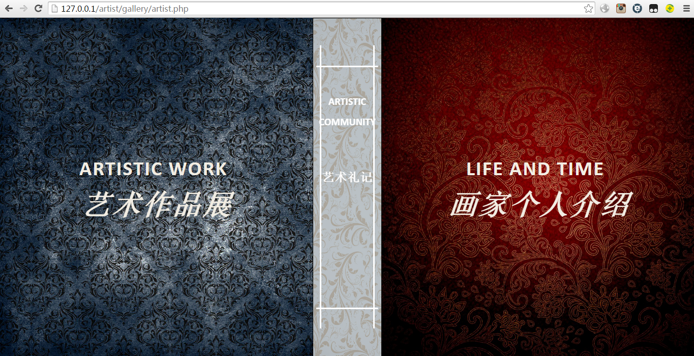
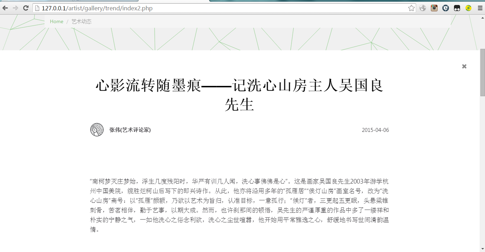

# artist website  
-intro+art show+admin  
html+css+javascript+php+mysql  
back-end admin entrance - /admin; user&password saved in table admin  
database related - /admin/mysql_connect.php; /gallery/mysql_connect.php, edit mysql_connect（）  
  
  
  
  
  
  
  
  
  
  

